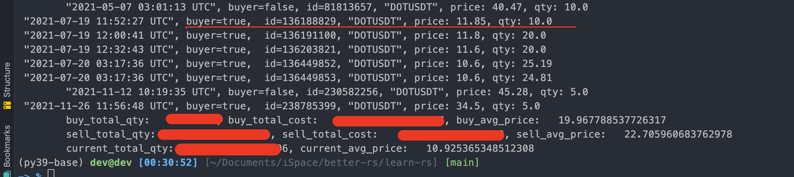
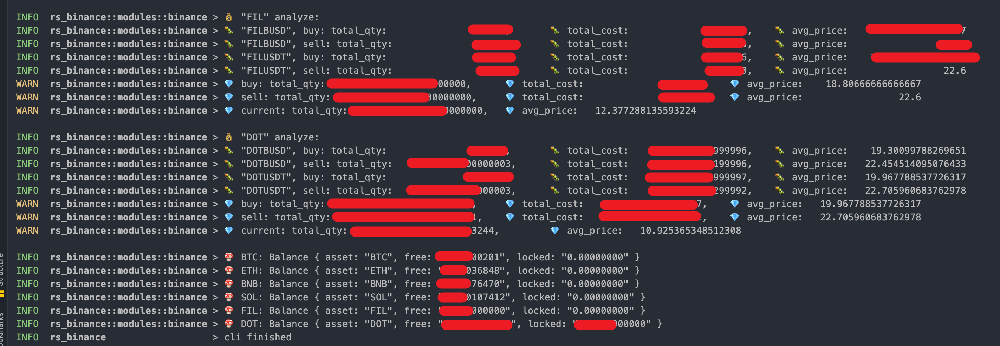

# learn-rs:

<p align="">
    <a href="https://discord.com/invite/MnDA9pfWAW" target="_blank">
      
    </a>
    <a href="https://discord.com/invite/MnDA9pfWAW" target="_blank">
      
    </a>
    
</p>

- ✅ 快速学习 rust.
- ✅ 基于 rust workspace 的 monorepo 方式.

## Related:

- ✅ https://github.com/better-rs/annotated-rs
    - 注解 rust 知名项目源码
    - ⭐⭐⭐⭐⭐

## 目录:

> Rust 学习:

| 子项目                                                | 说明                              | 备注          |
|:---------------------------------------------------|:--------------------------------|:------------|
| [rust-by-example](./crates/rs-101/rust-by-example) | Rust 官方练习代码                     | ⭐⭐⭐         |
| [basic](./crates/rs-101/basic)                     | Rust 语法练习                       | ⭐           |
| [rs-leetcode](./crates/rs-leetcode)                | 使用 Rust 刷题(leetcode)            | TODO        |
| [rs-try](./crates/rs-try)                          | Rust 第三方lib 验证/调研               | ⭐⭐          |
| [rs-ffi](./crates/rs-ffi)                          | Rust + FFI                      | ⭐⭐⭐         |
| [rs-tonic](./crates/rs-tonic)                      | Rust + gRPC(Tonic)              | ⭐⭐⭐         |
| [rs-volo](./crates/rs-volo)                        | Rust + gRPC(Volo)               | ⭐⭐⭐         |
| [rs-sql](./crates/rs-sql)                          | Rust + sqlx 使用                  | ⭐⭐          |
| xxxxxxxxxxxxxx                                     | xxxxxxxxxxxxxxxxxx              | xxxxxxxx    |
| xxxxxxxxxxxxxx                                     | xxxxxxxxxxxxxxxxxx              | xxxxxxxx    |

> 基于 Rust 写的脚本工具和业务系统:

| 子项目                                 | 说明                               | 备注                  |
|:------------------------------------|:---------------------------------|:--------------------|
| [rs-cli](./crates/rs-cli)   | rust cli 脚本工具: Binance 持币成本计算器   | ⭐⭐⭐⭐⭐               |
| [rs-tauri-vue](crates/rs-tauri-vue) | Rust + Tauri + Vue.js 桌面App开发脚手架 | ⭐⭐⭐                 |
| [rs-cms](./crates/rs-cms)           | rust 小型 CMS 系统, 小型电商原型           | ⭐⭐⭐                 |
| xxxxxxxxxxxxxx                      | xxxxxxxxxxxxxxxxxx               | xxxxxxxxxx          |
| xxxxxxxxxxxxxx                      | xxxxxxxxxxxxxxxxxx               | xxxxxxxxxx          |

## 基于 Rust 写的小工具:

- ✅ [rs-cli](./crates/rs-cli)
    - 写的一些 rust 脚本工具
        - [x] ETH 链上交易查询
        - [x] Binance 交易所个人交易数据查询/K 线数据查询(支持 api key 方式下单/撤单)
        - [x] Binance 交易所币种持有成本计算器

> 快速安装小工具集:

```ruby
# cd root directory:
cd learn-rs/

# install:
task cli:install

```

- 安装成功:

```ruby

rs-cli v0.1.0 (/better-rs/learn-rs/crates/rs-cli):
    discord-bot
    rs-binance
    rs-eth-scanner
    rs-cli
    rs-tui

```

- 使用示例:

```ruby
-> % rs-binance
binance 0.1.0
A binance CLI

USAGE:
    rs-binance <SUBCOMMAND>

OPTIONS:
    -h, --help       Print help information
    -V, --version    Print version information

SUBCOMMANDS:
    auth      auth: get user account data
    help      Print this message or the help of the given subcommand(s)
    market    market: get market data

```


### 1. 币安 - 持币平均成本计算器

> 效果:




> 源码位置:

- ✅ [crates/rs-cli/src/bin/binance.rs](crates/rs-cli/bin/binance.rs)
- ✅ 启动脚本: [crates/rs-cli/Taskfile.yml](crates/rs-cli/Taskfile.yml)

> 功能说明:

1. 目前支持: 币安交易所.
2. 支持单个币种 + 多个交易对 合并计算.
    - 比如使用过 BUSD, UDST 购买 ETH, 需要合并计算 ETH 持有成本. (是支持的)
3. 会自动计算: 买单平均成本, 卖单平均成本, 持币总数, 持币总成本.

> 使用方式:

1. git clone 本项目
2. 安装 rust, go-task(替代 Makefile 的命令行工具)
3. copy .env.local 到 .env, 然后在 .env 添加 币安 api key(先在币安 web 版, 个人用户设置内申请).

```ruby

#
# 项目根目录内执行: (Taskfile.yml 支持嵌套)
#
# 自动计算币安币种的持有成本, 比如 ETH/BTC/DOT
task cli:run:binance

```

## Requirements:

- ✅ rust: `1.65.0+`
- ✅ [go-task](https://github.com/go-task/task)

```ruby
➤ rustc --version
rustc 1.65.0-nightly (17cbdfd07 2022-09-13)


➤ cargo version
cargo 1.65.0-nightly (646e9a0b9 2022-09-02)


➤ rustup show
Default host: aarch64-apple-darwin
rustup home:  /Users/dev/.rustup

installed toolchains
--------------------

stable-aarch64-apple-darwin
nightly-2022-07-31-aarch64-apple-darwin
nightly-aarch64-apple-darwin (default)
1.61.0-aarch64-apple-darwin

active toolchain
----------------

nightly-aarch64-apple-darwin (default)
rustc 1.65.0-nightly (17cbdfd07 2022-09-13)

```

## docs:

- ✅ [本项目说明: 开发环境搭建](./docs/dev.md)
- ✅ [Rust 学习笔记](./docs/readme.md)
