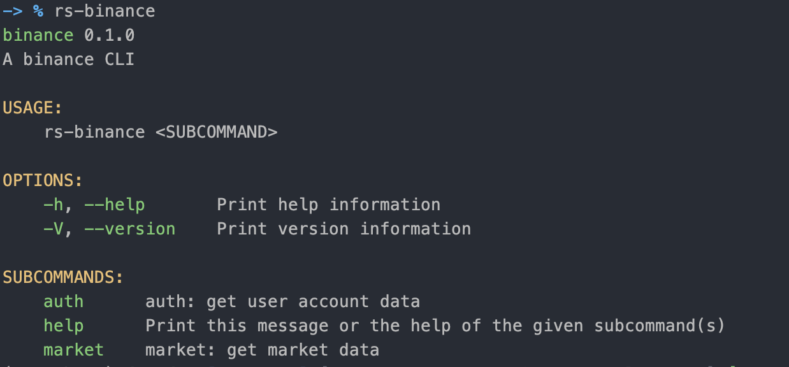

# learn-rs:

- rust 练习代码

## Related:

- https://github.com/better-rs/annotated-rs
    - 注解 rust 知名项目源码
    - ⭐⭐⭐⭐⭐

## 项目目录:

> Rust 学习:

- [x] [rust-by-example](./crates/rust-by-example)
    - 官方练习代码
- [x] [rs-leetcode](./crates/rs-leetcode)
    - 使用 Rust 刷题, leetcode 练习代码
- [x] [basic](./crates/basic)
    - Rust 基础语法练习

> 基于 Rust 写的脚本工具和业务系统:

- [x] [rs-scripts](./crates/rs-scripts)
    - 写的一些 rust 脚本工具
        - [x] ETH 链上交易查询
        - [x] Binance 交易所个人交易数据查询/K 线数据查询(支持 api key 方式下单/撤单)
        - [x] Binance 交易所币种持有成本计算器
- [x] [rs-cms](./crates/rs-cms)
    - 基于 rust 写的小型 CMS 系统, 目前进度 10%
    - 一个小型电商平台原型

## 基于 Rust 写的小工具:

- [rs-scripts](./crates/rs-scripts)

> 快速安装小工具集:


```ruby
cd this-project-root/

# install:
task scripts:install

```

- 安装成功:

```ruby

rs-scripts v0.1.0 (/better-rs/learn-rs/crates/rs-scripts):
    discord-bot
    rs-binance
    rs-eth-scanner
    rs-scripts
    rs-tui

```

- 使用示例:


```ruby
-> % rs-binance
binance 0.1.0
A binance CLI

USAGE:
    rs-binance <SUBCOMMAND>

OPTIONS:
    -h, --help       Print help information
    -V, --version    Print version information

SUBCOMMANDS:
    auth      auth: get user account data
    help      Print this message or the help of the given subcommand(s)
    market    market: get market data

```




### 1. 币安 - 持币平均成本计算器

> 效果:


> 源码位置:

- [crates/rs-scripts/src/bin/binance.rs](crates/rs-scripts/src/bin/binance.rs)
- 启动脚本: [crates/rs-scripts/Taskfile.yml](crates/rs-scripts/Taskfile.yml)

> 功能说明:

1. 目前支持: 币安交易所.
2. 支持单个币种 + 多个交易对 合并计算.
    - 比如使用过 BUSD, UDST 购买 ETH, 需要合并计算 ETH 持有成本. (是支持的)
3. 会自动计算: 买单平均成本, 卖单平均成本, 持币总数, 持币总成本.

> 使用方式:

1. git clone 本项目
2. 安装 rust, go-task(替代 Makefile 的命令行工具)
3. copy .env.local 到 .env, 然后在 .env 添加 币安 api key(先在币安 web 版, 个人用户设置内申请).

```ruby

#
# 项目根目录内执行: (Taskfile.yml 支持嵌套)
#
# 自动计算币安币种的持有成本, 比如 ETH/BTC/DOT
task scripts:run:binance

```

## docs:

- [本项目说明: 开发环境搭建](./docs/dev.md)
- [Rust 学习笔记](./docs/README.md)
